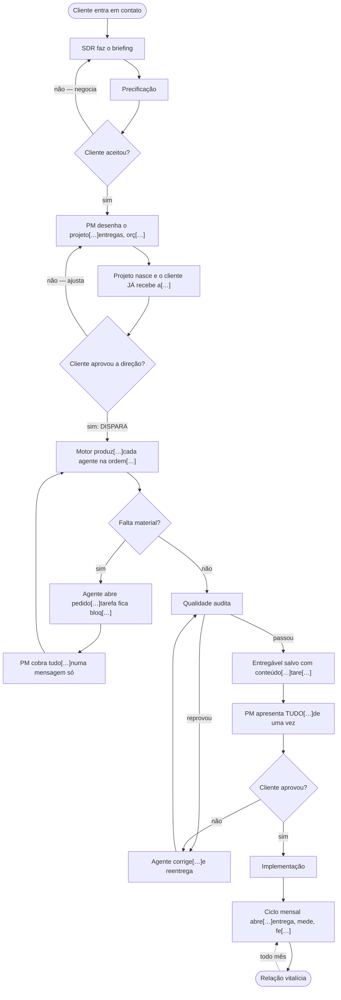

# Cursograma da agência — "A esteira da Dioli, construída"

> **O que é este arquivo.** Transcrição íntegra do PDF que o CEO anexou ao chat em
> **01/08/2026 às 19:27** (`A_esteira_da_Dioli___constru_da.pdf`, gerado em
> 29/07/2026). É o documento que ele chama de **cursograma da agência**.
>
> **Procedência, com todas as letras:** o PDF foi *enviado* pelo CEO, mas foi
> *escrito* por uma sessão anterior do Claude para o CEO — o texto fala em
> primeira pessoa com ele ("Você pediu para eu propor"). Ou seja: é a fonte que
> ele pediu para guardar, mas não é um documento de autoria dele.
>
> **Não editar.** Transcrição literal, sem resumo e sem "melhoria". Onde o próprio
> PDF corta o texto de uma caixa do diagrama, o corte está marcado com `[…]`.
> O PDF original está preservado em
> [`docs/fontes-do-ceo/2026-08-01-A-esteira-da-Dioli-construida.pdf`](fontes-do-ceo/2026-08-01-A-esteira-da-Dioli-construida.pdf).

---

DIOLI AGENCY OS · ESTEIRA CONSTRUÍDA · 29/07/2026

# A esteira agora anda sozinha

A agência já tinha departamentos, agentes e um motor de produção bom. Não faltava
inteligência — **faltava esteira**. O motor existia e estava desligado, as tarefas
congelavam em "pendente", e o cliente abria o portal e via cartões vazios. Isso
acabou.

| QUEBRAS FECHADAS | TESTES NOVOS | SUÍTE | MIGRAÇÃO |
|---|---|---|---|
| 5 | 44 | 182 | aditiva |

---

## O cursograma

Legenda do diagrama original: **construído agora** · **já existia** · **ponto de decisão**

---

## As cinco quebras, fechadas

Cada uma com o que acontecia antes e o que acontece agora.

### 01 · Ninguém ligava o motor

**Antes:** o projeto nascia e ficava parado esperando alguém que nunca vinha.
Nenhuma tela chamava a produção.

**Agora:** o projeto nasce e o cliente já recebe a direção para avalizar. O aval
dispara a produção sozinho. Achei de quebra que um dos dois criadores de projeto
nem vinculava a solicitação de origem — e sem esse vínculo o motor recusa
produzir. Era uma das razões de nada nunca começar.

### 02 · As tarefas nunca mudavam de status

**Antes:** nasciam em "pendente" e morriam em "pendente". Por isso ninguém sabia
quem trabalhava, quem entregou, quem travou.

**Agora:** o motor move cada tarefa no mesmo instante do trabalho — na fila →
produzindo → em revisão → entregue, já ligada ao entregável que a cumpriu. Falta
material do cliente? A tarefa fica bloqueada, não fingindo que está ativa.

### 03 · Duas esteiras, uma delas jogando o trabalho fora

**Antes:** as seis telas manuais salvavam só o título. O material da IA ia para o
lixo e o portal mostrava cartões vazios.

**Agora:** todas gravam o conteúdo, por um serializador que não perde campo — o
que a IA produziu aparece no texto. Conteúdo curto demais não vira entrega:
cartão vazio com outro nome continua sendo cartão vazio.

### 04 · A relação vitalícia não tinha onde acontecer

**Antes:** depois da primeira aprovação, a esteira não tinha próximo passo.

**Agora:** existe o ciclo mensal — nasce, entrega, mede, fecha, abre o próximo. O
plano do mês é congelado na abertura: relatório que nunca erra é relatório que
não mede nada. É isso que permite dizer "agosto foi melhor que julho".

### 05 · Cinco agentes falando com o cliente

**Antes:** cada agente mandava a própria mensagem, assinando com o próprio nome.
O cliente recebia pedidos soltos, sem ordem.

**Agora:** o agente abre pedido, o gerente de projeto consolida e fala — uma
mensagem com tudo. E não cobra duas vezes a mesma coisa. A entrega pronta também
não pinga mais no portal: quem apresenta é o PM, de uma vez.

---

## As duas coisas que eu mudei do seu modelo

Você pediu para eu propor. Estas duas eu implementei diferente do que você
descreveu.

### O portão de direção — aprovar barato antes de produzir caro

No seu modelo, o cliente só vê quando todos os agentes entregam. O risco é
conhecido: ele vê tudo pronto, não gosta do rumo, e o mês é refeito. Então a
produção agora só roda com a direção avalizada. Mudar o caminho antes custa uma
conversa; depois, custa o mês. O resto do seu modelo continua: a apresentação
final é uma só, feita pelo PM, com tudo pronto.

### Uma voz, não seis

Você descreveu cada agente falando direto com o cliente. Mantive os agentes
autônomos por dentro — cada um sabe do que precisa — mas quem fala é o gerente de
projeto. Cinco vozes pedindo coisas soltas é o que faz uma agência parecer
desorganizada mesmo entregando bem.

---

## As telas que se explicam sozinhas

Seu pedido: quem abre precisa entender de cara. Vale para o cliente leigo e para
quem trabalha aqui.

### Uma frase antes de qualquer número

Painel que abre com métrica exige que a pessoa monte o significado sozinha. A
faixa abre com a leitura pronta: "Produção rodando — 2 de 4 entregas prontas".

### Quem tem a bola, em destaque

A pergunta que trava projeto de agência nunca é "quanto por cento"; é "está
esperando quem?". Sem dono explícito, todo mundo acha que a vez é do outro.

### O que trava aparece — não se esconde

Pendência omitida vira surpresa na terceira semana. Ela ocupa espaço na tela de
propósito, com o nome do agente que travou.

### A trilha inteira, sempre visível

Ver as etapas seguintes é o que faz alguém entender o processo sem ninguém
explicar. Nove etapas, com a atual marcada.

### A mesma verdade dos dois lados

A tela da agência e o portal chamam a mesma função. Só a linguagem muda. Se cada
lado montasse a própria leitura, um dia o cliente veria um estado e a equipe
outro — e não há jeito pior de perder a confiança dele. No portal, jargão interno
é barrado por teste, não por boa vontade de quem escreve a próxima frase.

---

## O que falta para rodar hoje

**NADA — SE AS CHAVES JÁ ESTÃO NA TELA DE INTEGRAÇÕES**

O sistema busca a chave de IA em duas fontes, nesta ordem: primeiro a que foi
salva em Integrações → IAs dos Agentes (guardada criptografada no banco), e só
depois a variável de ambiente, como reserva para deploy antigo. Se a Dioli já
cadastrou pela tela, a esteira roda hoje.

O motor ainda tenta o Claude primeiro e cai para os outros provedores se ele não
estiver configurado — com qualquer uma das chaves salva, a produção acontece.

O único ponto a conferir: a chave é buscada por workspace. Se foi salva num
workspace e os projetos vivem em outro, o motor não a encontra. É um clique:
abrir Integrações logado no workspace dos projetos e ver o indicador.

Sobre a migração: a coluna do portão de direção nasce vazia nos projetos que já
existem, então eles vão esperar o aval — que é o comportamento correto. Para os
pilotos, basta aprovar a direção pela tela do projeto.

---

Construído em 29/07/2026 no branch `claude/esteira-da-agencia`. 44 testes novos
cobrindo fases, marcos, ciclos, conteúdo, motor e a jornada completa de um
cliente. Suíte inteira 182 verde, tsc limpo, build compilando, eslint idêntico ao
baseline. A migração é aditiva: só colunas opcionais e uma tabela nova.
