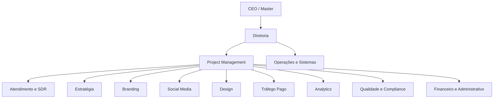
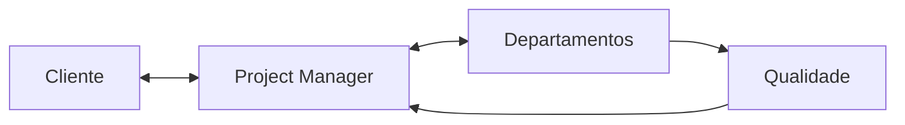

# Arquitetura Mestra

## Decisão

A Dioli funcionará como uma agência híbrida: agentes de IA e pessoas ocupam **funções operacionais equivalentes**, com permissões definidas pelo departamento. O sistema não pode depender de o executor ser IA ou humano.

## Princípios não negociáveis

1. **Cliente é carteira, não projeto.** Um cliente possui projetos, campanhas, ciclos e entregas.
2. **Uma voz com o cliente.** O Project Manager consolida pedidos, apresenta entregas e registra decisões.
3. **Especialistas executam; PM orquestra.** O PM não substitui departamentos.
4. **Todos consultam todos os clientes.** Equipes internas veem o overview do cliente em modo leitura; editam apenas a própria área.
5. **Master e Diretor veem e editam tudo.** As páginas atuais permanecem acessíveis a esses papéis durante a revisão.
6. **Qualidade é portão.** Nada segue ao cliente sem revisão interna, salvo exceção auditada do Diretor.
7. **Sem suposição silenciosa.** Informação ou material ausente gera lacuna, responsável e prazo.
8. **Estado é derivado de fatos.** Nenhum usuário digita livremente o status da esteira.
9. **Toda transição deixa rastro.** Quem, quando, origem, motivo, versão e correlação.
10. **Falha não pode desaparecer.** Ela vira bloqueio visível e ação de recuperação.

## Organograma operacional

O organograma representa coordenação operacional, não subordinação técnica. Qualidade pode bloquear entregas; Financeiro pode bloquear contratação ou publicação com custo; Operações pode pausar automações inseguras.

## Regra de comunicação

O cliente não coordena departamentos. Um especialista pode participar de reunião quando o PM convocar, mas o histórico, a decisão e a próxima ação permanecem centralizados.

## Visão das superfícies

- **Central de Trabalho:** visão individual do executor, filas, dependências e prazos.
- **Clientes:** overview transversal disponível a toda equipe interna; edição condicionada à área.
- **Departamento:** operação especializada, ferramentas e indicadores da área.
- **PM Command Center:** portfólio, riscos, comunicação, aprovações e recuperação.
- **Portal do Cliente:** resultados primeiro; projetos, aprovações, entregas, solicitações, Brand Hub, integrações e conta.
- **Diretoria/Master:** todos os módulos, saúde da operação, auditoria, custos e configurações.

## Decisões de arquitetura

| ID | Decisão |
|---|---|
| D-01 | Substituir as definições departamentais existentes por um catálogo canônico único |
| D-02 | Modelar agentes como capacidades/funções, não como páginas independentes |
| D-03 | PM é o dono da comunicação externa e do handoff |
| D-04 | Overview de clientes é leitura transversal; escrita é departamental |
| D-05 | Máquina de estados é única para portal e painel interno, mudando apenas a linguagem |
| D-06 | Correção volta ao responsável; aprendizado volta a Analytics, Estratégia e Branding |
| D-07 | O novo modelo é migrado por compatibilidade, nunca por exclusão direta de dados |

