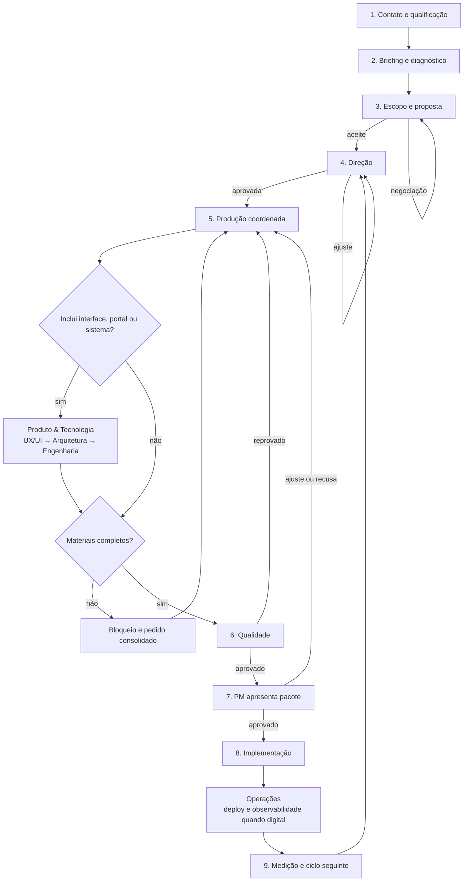
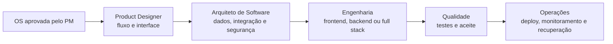

# Esteira Integrada e Handoffs

## Fluxo principal

## Contrato dos nove marcos

| Marco | Dono | Entrada mínima | Saída obrigatória | Exceção |
|---|---|---|---|---|
| Contato e qualificação | SDR | contato e demanda | oportunidade qualificada ou encerrada | sem aderência |
| Briefing e diagnóstico | SDR + Estratégia + Branding | oportunidade qualificada | briefing estruturado e lacunas | aguarda cliente |
| Escopo e proposta | Estratégia + Financeiro | briefing suficiente | escopo, preço, prazo e aceite | negociação/recusa |
| Direção | PM | aceite comercial | plano, ordem, entregas e aval do cliente | ajuste de direção |
| Produção | Departamentos contratados, incluindo Produto & Tecnologia quando houver entrega digital | direção aprovada | pacote interno versionado | bloqueio material/técnico |
| Qualidade | Qualidade | pacote completo | aprovado ou devolvido com motivo | exceção de Diretor auditada |
| Apresentação | PM | pacote aprovado internamente | decisão do cliente | ajuste, recusa ou cancelamento |
| Implementação | Área responsável + Produto & Tecnologia + Operações, quando digital | aprovação do cliente | publicação/ativação/entrega final | falha operacional |
| Medição e ciclo | Analytics + PM + Estratégia | implementação registrada | relatório, aprendizado e próximo plano | dados indisponíveis |

## Regra dos handoffs

Cada passagem precisa gravar:

- `from_department` e `to_department`;
- responsável que entregou e responsável que recebeu;
- entrada, saída e versão do artefato;
- critérios usados para considerar a etapa concluída;
- prazo do próximo responsável;
- bloqueios e dependências;
- `correlation_id` do cliente, projeto, ciclo e solicitação de origem.

Sem aceite do handoff, a tarefa não some da fila anterior: ela aparece como “aguardando recebimento”.

## Comunicação com o cliente

- Agentes geram perguntas e necessidades internamente.
- O PM deduplica e consolida em uma mensagem.
- O cliente responde uma vez.
- A resposta é distribuída às tarefas dependentes.
- O histórico fica ligado ao cliente, projeto e ciclo.

## Aprovação do cliente

Toda entrega admite quatro decisões:

1. **Aprovar** — autoriza a próxima etapa prevista.
2. **Pedir ajustes** — preserva o trabalho e abre revisão com comentário.
3. **Recusar/refazer** — devolve por desalinhamento relevante e exige justificativa.
4. **Cancelar** — encerra aquela entrega/escopo com ressalva e auditoria.

Recusar e cancelar nunca apagam versões anteriores.

## Subfluxo de interface, portal ou sistema

O PM é a ponte com o solicitante e preserva o escopo. Produto & Tecnologia é responsável pela solução técnica. Qualidade impede a passagem de defeitos e Operações controla a publicação e a saúde do ambiente.
