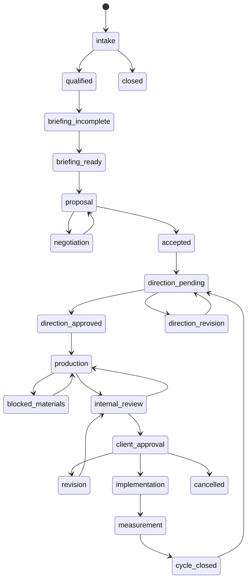

# Estados, Bloqueios e Recuperação

## Estados canônicos

## Regra de transição

Uma transição só ocorre quando:

1. o ator tem permissão;
2. a entrada obrigatória existe;
3. a versão do estado não mudou desde a leitura;
4. a operação possui chave de idempotência;
5. o evento e a próxima ação são persistidos;
6. efeitos externos entram em fila com retentativa.

## Bloqueios tipados

- `missing_client_information`
- `missing_asset`
- `missing_credential`
- `integration_unavailable`
- `quality_rejected`
- `client_decision_pending`
- `financial_hold`
- `policy_or_security_risk`
- `technical_failure`

Todo bloqueio possui dono, data de abertura, SLA, evidência, ação recomendada e escalonamento.

## Recuperação

- Scheduler com heartbeat e alerta por ausência.
- Retentativa exponencial para falha transitória.
- Dead-letter queue para falha repetida.
- Botão “Retomar processo” exclusivo de PM/Diretor, idempotente.
- Detector de tarefa parada por estado e SLA.
- Reprocessamento por `correlation_id`, nunca por duplicação manual.
- Outbox para mensagem, webhook, publicação e aprovação externa.
- Backup e teste periódico de restauração.

## Conduta em falha de qualidade

Indisponibilidade do auditor não equivale a aprovação. O item fica `audit_pending`. Override requer Diretor, justificativa, escopo e validade.

## Observabilidade mínima

- volume e idade por estado;
- tarefas bloqueadas por motivo;
- falhas e retentativas por integração;
- tempo de handoff;
- taxa de retrabalho por agente/departamento;
- scheduler heartbeat;
- aprovações aguardando cliente;
- eventos sem consumidor e efeitos externos pendentes.

