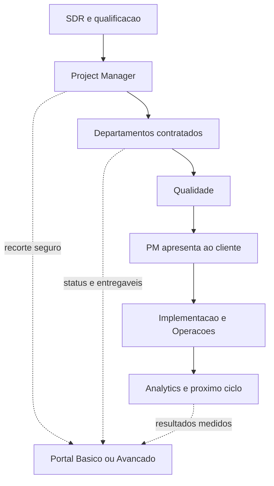

# Conexao com a arquitetura operacional da Dioli

## Documentos canônicos

Este projeto nao redefine departamentos nem esteira. As fontes oficiais ja existentes sao:

- `docs/arquitetura-operacional-v2/02-DEPARTAMENTOS-E-AGENTES.md` - departamentos, agentes, missoes, entregas e fronteiras;
- `docs/arquitetura-operacional-v2/03-ESTEIRA-E-HANDOFFS.md` - fluxo do SDR ate implementacao, medicao e novo ciclo;
- `docs/arquitetura-operacional-v2/visual/dioli-operating-model.html` - representacao visual integrada.

Se houver divergencia entre uma tela e esses documentos, a tela deve ser corrigida. Nao se cria um fluxo paralelo dentro do portal.

## Regra central

Os departamentos produzem e movimentam o trabalho internamente. O Portal do Cliente apresenta ao cliente apenas o recorte seguro, compreensivel e acionavel desse mesmo trabalho.

O modo Basico ou Avancado nunca muda o dono da etapa, o handoff, a permissao, o estado ou o caminho de aprovacao.

## Departamentos -> informacao no portal

| Departamento | O que produz internamente | Como aparece no Basico | Como aparece no Avancado |
| --- | --- | --- | --- |
| Atendimento e SDR | oportunidade, briefing inicial, contato e origem | dados iniciais e lacunas quando dependem do cliente | historico e contexto permitido |
| Project Management | ordem, dono, prazo, dependencias e comunicacao | proximos passos, pendencias consolidadas e conversa com PM | projetos, solicitacoes, entregas e timeline |
| Estrategia | objetivos, publico, mensagem, canais e KPIs | explicacao curta do caminho escolhido | estrategia, projeto e resultados detalhados |
| Branding | Brand Space, regras, assets, lacunas e score | Materiais, entrevista de marca e pendencias essenciais | Brand Hub completo |
| Social Media | calendario, conteudo, distribuicao e aprendizados | resumo de redes em Inicio/Resultados | Social Media completo |
| Design e Producao Criativa | pecas e arquivos versionados | aprovacao e entrega contextual | entregas, versoes e aprovacao detalhada |
| Trafego Pago e Performance | campanhas, verba, tracking e otimizacao | contatos, investimento e explicacao simples | Trafego Pago, metricas e diagnostico |
| Analytics e Inteligencia | metricas, alertas e recomendacao | ate tres numeros com contexto | tabelas, series, canais e atribuicao permitida |
| Qualidade e Compliance | aprovado, reprovado ou excecao | nao aparece como fila interna; impede entrega ruim | selo de validacao quando fizer sentido ao cliente |
| Financeiro e Administrativo | proposta, contrato, cobranca, custo e margem | apenas informacao contratual autorizada | conta e documentos autorizados; margem interna nunca aparece |
| Operacoes, Sistemas e Seguranca | integracoes, credenciais, monitoramento e recovery | pendencia de conexao apenas quando exige o cliente | Integracoes com saude e reconexao permitida |
| Produto & Tecnologia | UX/UI, arquitetura, codigo e pacote tecnico | marco simples do projeto digital | projeto, entregas, implementacao e status tecnico permitido |

## Nove marcos -> experiencia do cliente

| Marco da esteira | O cliente ve | Acao possivel |
| --- | --- | --- |
| 1. Contato e qualificacao | nada operacional antes de existir acesso valido | responder ao SDR fora ou dentro do intake autorizado |
| 2. Briefing e diagnostico | entrevista e lacunas consolidadas | responder e enviar materiais |
| 3. Escopo e proposta | proposta, prazo e decisao | aceitar, negociar ou recusar |
| 4. Direcao | plano explicado em linguagem de negocio | aprovar ou pedir ajuste de direcao |
| 5. Producao coordenada | status agregado e proximos passos | agir somente em bloqueio real |
| 6. Qualidade | nenhuma microfila interna | aguardar; material reprovado nao chega ao cliente |
| 7. PM apresenta pacote | entrega versionada e contexto | aprovar, ajustar, recusar/refazer ou cancelar |
| 8. Implementacao | publicacao, ativacao ou entrega final | confirmar acessos ou dependencia solicitada |
| 9. Medicao e ciclo | resultado, aprendizado e proximo plano | entender, decidir e iniciar novo ciclo |

## Project Manager como elo

- Os agentes nao cobram o cliente de forma independente.
- Cada area registra sua necessidade na operacao.
- O PM deduplica e consolida.
- O portal mostra uma unica pendencia compreensivel.
- A resposta do cliente volta para todas as tarefas dependentes pelo mesmo `correlation_id`.

## Handoffs que o portal nao pode quebrar

Cada passagem continua registrando departamento de origem e destino, quem entregou e recebeu, versao do artefato, criterio de conclusao, prazo, bloqueios e `correlation_id`.

Sem aceite do recebedor, a tarefa permanece na fila anterior. Alterar entre Basico e Avancado nao altera esse estado.

## Resultado esperado

O cliente enxerga uma historia continua - demanda, plano, producao, decisao, entrega e resultado - enquanto a agencia preserva departamentos especializados, permissao por papel, rastreabilidade e responsabilidade formal em cada handoff.
