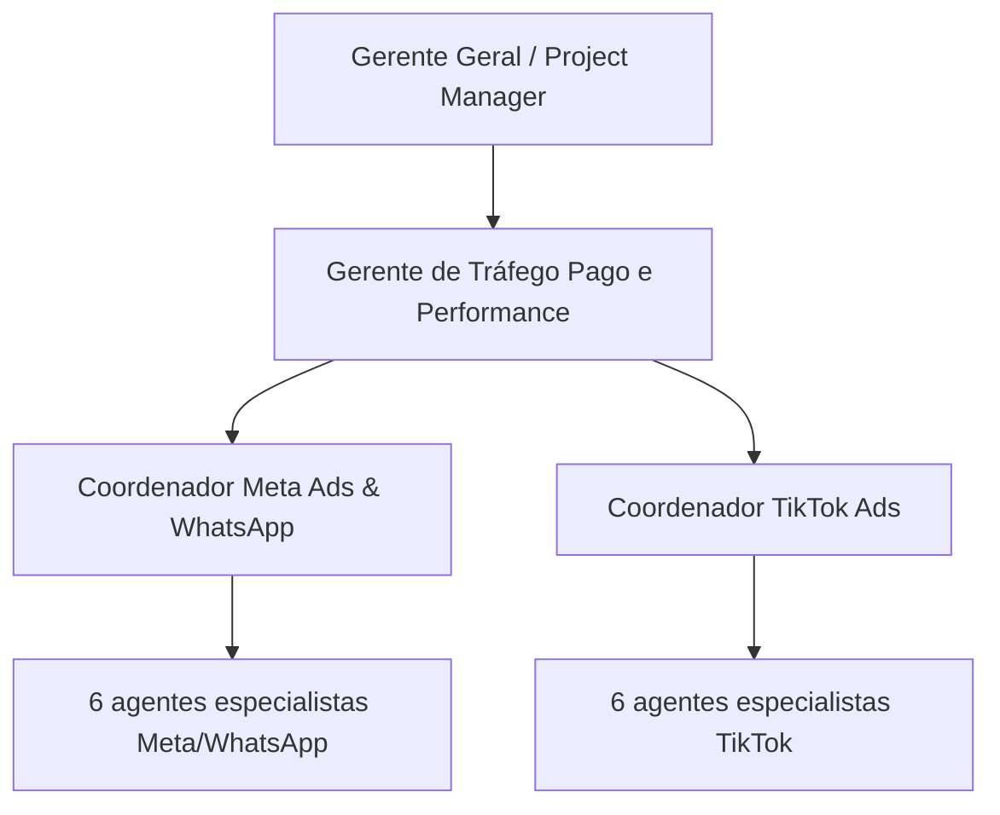

# Decisão e Escopo

## Modelo aprovado

O Gerente de Tráfego é o responsável por todo o departamento. Cada coordenador é o elo exclusivo entre o gerente e os agentes da sua plataforma.

## Por que Meta Ads & WhatsApp

WhatsApp é tratado nesta arquitetura como destino de conversa, conversão e relacionamento dentro da operação de mídia Meta. A célula cobre campanhas e mensuração relacionadas a Facebook, Instagram e WhatsApp, sem criar três estruturas concorrentes.

## Dimensão da V1

- 1 gerente departamental;
- 2 coordenadores de célula;
- 12 agentes especialistas;
- 15 funções canônicas em Tráfego Pago;
- 89 funções no catálogo total da agência após a migração, substituindo as 7 funções atuais de Tráfego pelas 15 novas.

As funções são capacidades operacionais, não equivalem obrigatoriamente a pessoas. Podem ser ocupadas por IA, pessoa ou modelo híbrido.

## Dentro do escopo

- catálogo e fichas das 15 funções;
- hierarquia gerente → coordenador → agentes;
- permissões por função e célula;
- roteamento de demandas por plataforma;
- handoffs e aceite formal;
- orçamento por célula e consolidação departamental;
- tracking específico por plataforma e atribuição transversal;
- observabilidade, auditoria e testes;
- compatibilidade com tarefas e dados legados;
- superfícies internas necessárias para visualizar gerente, células, filas e saúde.

## Fora do escopo

- ativar qualquer função em produção;
- publicar ou editar campanhas reais;
- movimentar verba;
- solicitar ou armazenar credenciais reais nesta entrega;
- abrir células Google, YouTube, LinkedIn, Pinterest ou Retail Media;
- substituir o Gerente Geral, o Brain, o PM ou a máquina de estados;
- redesenhar o Portal do Cliente.

## Expansão futura

Uma nova célula só entra no catálogo ativo depois de decisão registrada, baseada em pelo menos um dos fatores abaixo:

- cliente ou contrato exige a plataforma;
- verba relevante justifica governança própria;
- volume recorrente ameaça SLA da estrutura atual;
- políticas, API ou mensuração exigem especialização isolada.

Toda expansão reutiliza o mesmo contrato de célula, sem copiar regras divergentes.
