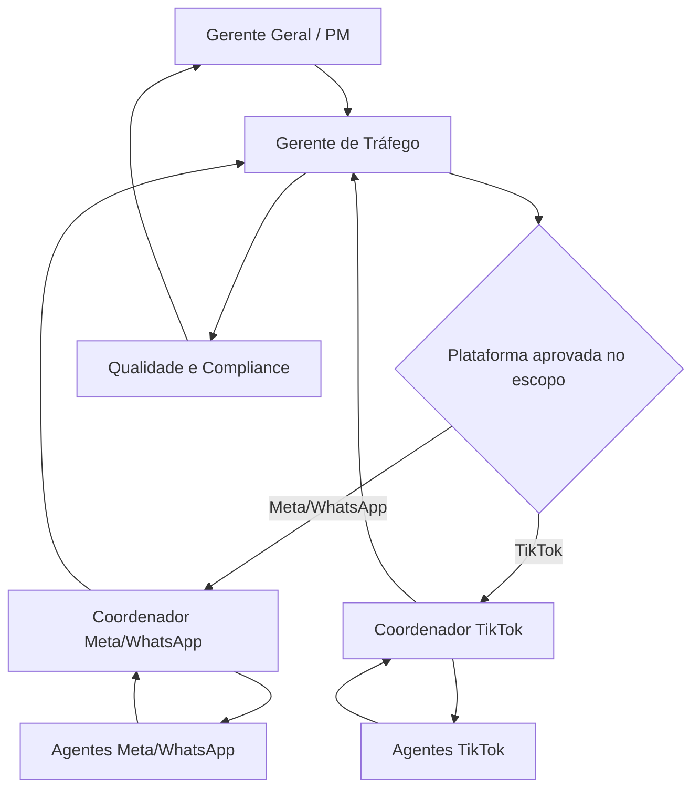

# Handoffs e Governança

## Fluxo principal

Demanda sem plataforma definida não é distribuída por suposição: permanece com o Gerente de Tráfego para decisão ou pedido consolidado ao PM.

## Contrato mínimo de entrada da célula

- cliente, projeto, ciclo e `correlation_id`;
- plataforma autorizada;
- objetivo e etapa do funil;
- público e região;
- oferta e destino da conversão;
- verba total, período e limites;
- criativos e regras de marca disponíveis;
- eventos e fonte de verdade para conversão;
- critérios de sucesso;
- aprovações e restrições aplicáveis.

## Saída consolidada do coordenador

- plano e versão executada;
- estrutura de campanha proposta ou configurada em ambiente permitido;
- prova de tracking;
- verba utilizada ou prevista versus limite;
- resultados e anomalias;
- histórico de otimizações;
- leitura criativa;
- riscos, dependências e próxima ação;
- aceite das entregas dos agentes da célula.

## Orçamento

- o Gerente de Tráfego controla o teto consolidado do departamento;
- cada coordenador recebe um envelope de verba por cliente, plataforma e período;
- o Guardião de Verba controla o uso dentro desse envelope;
- redistribuição entre Meta/WhatsApp e TikTok exige decisão do gerente e registro auditável;
- estouro previsto interrompe a ação e escala antes do gasto;
- gasto real inesperado é registrado e escalado, nunca ocultado.

## Tracking e atribuição

- os agentes de tracking implementam e validam integrações específicas de cada plataforma;
- Analytics mantém a visão transversal e a regra de atribuição da agência;
- nomes de eventos e conversões devem seguir contrato comum;
- divergência entre plataformas vira achado explícito, não número combinado silenciosamente.

## Criativos e outros departamentos

Recomendações de criativo saem do agente para o coordenador e seguem pelo Gerente de Tráfego até o Gerente Geral. O PM cria ou distribui o handoff para Design, Social Media ou Branding. Nenhum agente de tráfego altera peça ou regra de marca silenciosamente.

## Aceite de handoff

Todo handoff registra origem, destino, responsáveis, versão, entrada, saída, critério de conclusão, prazo e bloqueios. Sem aceite do recebedor, a tarefa continua visível na fila anterior como `aguardando_recebimento`.
